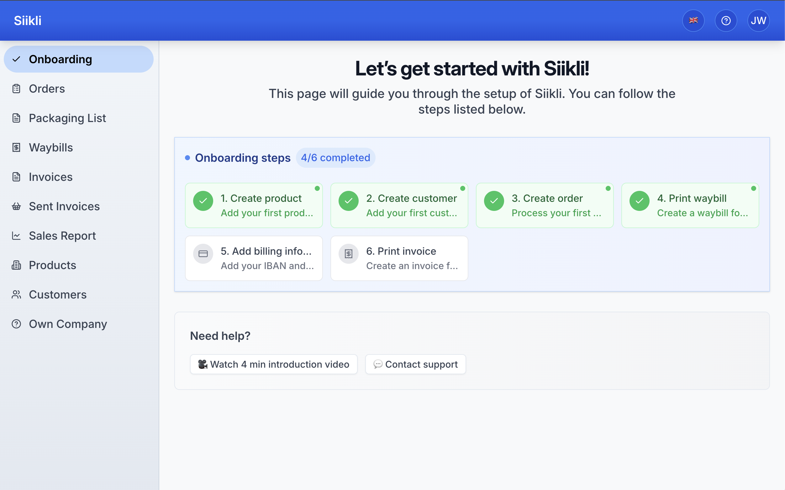
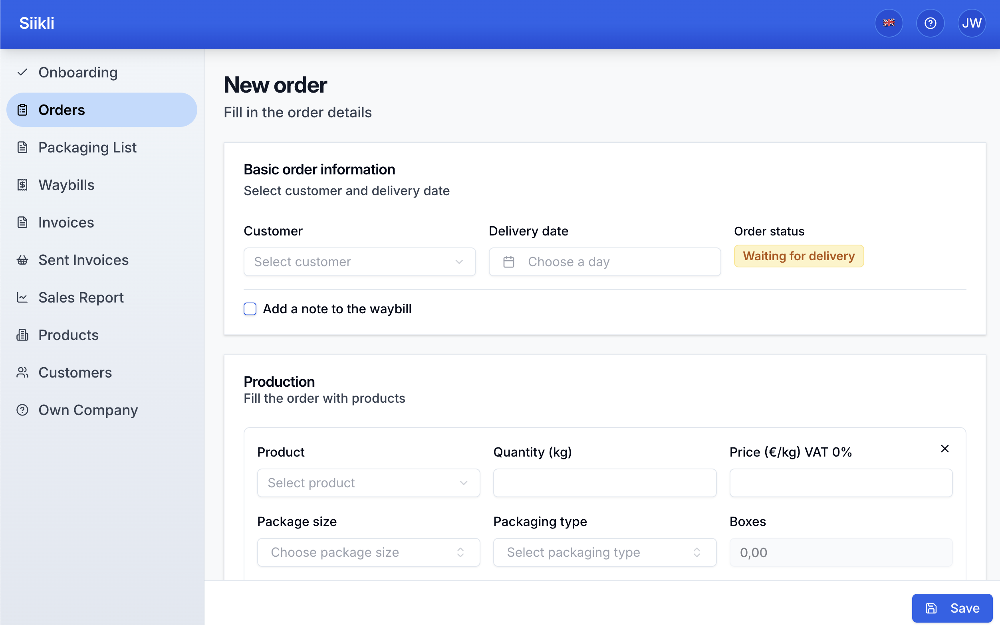
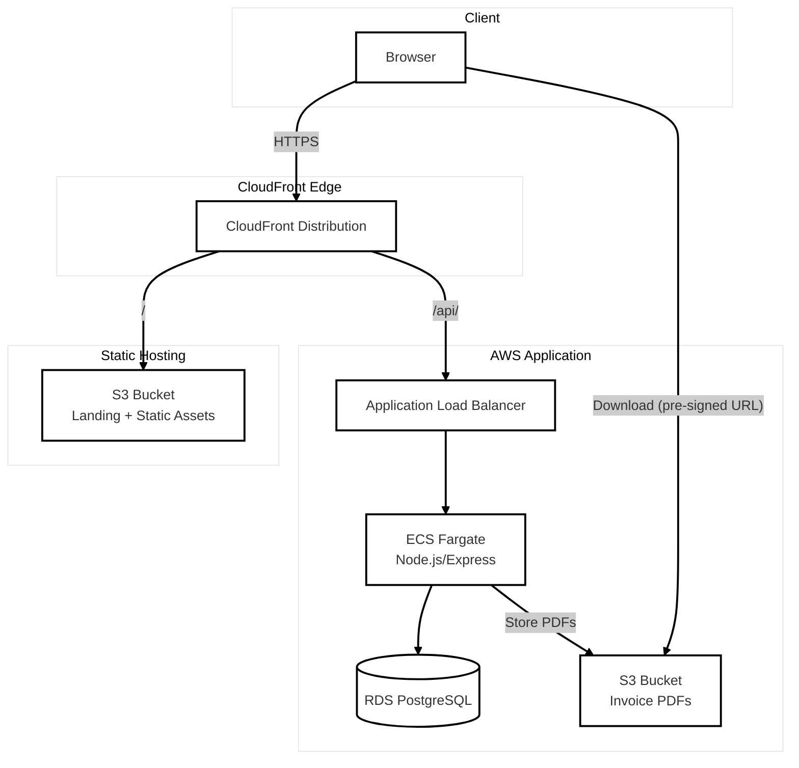

# 🌾 Siikli

[](https://github.com/juhawilppu/siikli/actions/workflows/ci.yml)
[](https://codecov.io/gh/juhawilppu/siikli)

Siikli is a simple ERP built for the realities of Finnish agriculture. In daily production use since 2017, it has processed more than €10M in invoices — simply, reliably, and without unnecessary complexity.

Rebuilt in 2025 with a modern stack.


<small>Onboarding workflow to get users started.</small>


<small>Create order with product + package size/type selection.</small>

## Highlights

- **Tenant-isolated, multi-tenant backend** → [prisma.ts](backend/src/prisma.ts)
- **Reusable order list component used by multiple pages** → [OrderListBase.tsx](frontend/src/app/components/OrderListBase.tsx)
- **Automated backups** → [backups.tf](terraform/modules/backups/main.tf)
- **Deployment pipeline using role-based trust authentication** → [ci.yml](.github/workflows/ci.yml)
- **Tested invoice generation (VAT, totals, HTML)** → [invoice-service.test.ts](backend/src/services/invoice-service.test.ts) and [invoice-html.test.ts](backend/src/services/invoice-html.test.ts)
- **End-to-end monorepo with shared types**
- **Built for production: €10M+ invoiced since 2017**

## Features

- Orders & invoicing (each order includes product + package size/type selection)
- Packaging workflow for daily deliveries + waybill generation for truck drivers
- Customer management with support for discounts
- Product & price list management
- Full change history and audit trail
- Excel export for sales reporting and bookkeeping

## Architecture



## Tech stack

- **Frontend:** `React`, `Vite`, `TypeScript`
- **Backend:** `Node.js`, `Express`
- **ORM:** `Prisma`
- **Database:** `PostgreSQL`
- **Infrastructure as Code:** `Terraform`
- **Cloud:** `AWS (ECS Fargate, S3, RDS, SES)`

## Getting started

```
cp .env.example .env
npm install
npm run dev
```

## Project structure

```bash
siikli/
├── frontend/
├── backend/
├── packages/      # Code shared between frontend and backend (shared types, utils)
├── terraform/
├── .env
└── ...
```

## Docs

- [Architecture](docs/architecture.md)
- [Deployment](docs/deployment.md)
- [Security](docs/security.md)
