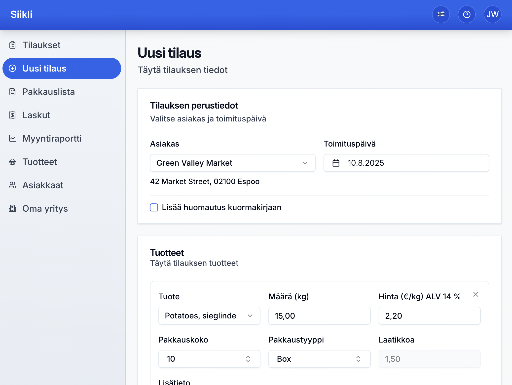

# 🌾 Siikli

Siikli is a modern ERP built for the realities of Finnish agriculture. It’s used in production to manage millions of euros in orders and invoices — simply, reliably, and without unnecessary complexity.



Whether it’s keeping track of inventory, sending invoices, or managing customers, Siikli streamlines the essential operations of agricultural businesses.

> “Everything you need. Nothing you don’t.”

🚀 Features

- 📦 Order & invoicing — from quote to paid invoice
- 👥 Customer & supplier management
- 📋 Product & price list management (incl. VAT & no-VAT pricing)
- 📊 Simple, exportable reports for bookkeeping
- 🔍 Full history tracking for every change

## 🧰 Tech stack


## 🛠️ Getting started

```
# 1. Configure environment variables
cp .env.example .env

# 2. Install dependencies & start
cd siikli
npm install
npm run dev
```

The frontend and backend run concurrently via `npm run dev`.

## 📁 Project structure

```bash
siikli/
├── frontend/      # React frontend
├── backend/       # Backend source code
├── packages/      # Code shared between frontend and backend (REST types, utils)
├── terraform/     # Terraform files for AWS infra and deployment
├── .env           # Environment variables
└── ...
```

## 🧱 Architecture

### Layered structure

Follows a **Service–Controller–Model** pattern for clarity, testability, and separation of concerns:

- **Controller** -- Handles HTTP, request validation, and permissions.
- **Services** -- Business logic.
- **Model** -- Database access via prisma.

### Type safety

- No complex TypeScript generics (Omit, Partial, etc.).
- Each endpoint has dedicated request/response DTOs for explicit, predictable types.

### ORM-first

- Prisma is the default for DB access.
- Raw SQL used for performance-critical special cases.
- Database: `snake_case`; TypeScript: `camelCase`.

### Tenant isolation

- Every tenant has isolated data (`company_id` in all relevant tables).
- Prisma middleware enforces tenant scoping in queries.
- RBAC is tenant-aware.
- Tenant ID in JWT payload.

### History tables

- Every table has a `_history` table updated via triggers on `INSERT`, `UPDATE`, `DELETE`.
- Enables debugging, partial restores, and full change tracking.

To ensure schema consistency, run:

```bash
npx tsx ./src/dev/verify-history-tables.ts
```

Validates that history tables are in sync with schema.

### Handling monetary values

Finnish currency uses a comma and two decimals (`2,50`), but users may type `2.5` or `2,5`.

Solution: Keep monetary values as **strings** in the UI until calculations are needed.
- **Database:** `@db.Decimal(10, 2)` for exact precision.
- **API:** Uses strings (`"10.00"`) for serialization.
- **UI:** Accepts multiple formats (`"10"`, `"10,0"`, `"10.0"`, etc.), formats to `"10,00"` on blur.
- **Mobile:** Numeric keyboard for better UX.
- **Calcultions:** Uses `decimal.js` for precision.

## Deployment

- ECS + Fargate for containers.
- RDS for database.
- Terraform for provisioning.
- Currently runs in `eu-north-1` (Sweden).

## Security

Security-first approach:

- ✅ Security headers & CSP
- ✅ SQL injection & XSS prevention via framework
- ✅ Role-based access control
- ✅ Tenant isolation via Prisma middleware
- ✅ UUID-based identifiers
- ✅ Rate-limiting
- ✅ Passwordless login
- ✅ Secure cookies (HttpOnly)
- ✅ IDOR prevention
- ✅ ALTCHA bot protection

## Simplicity

- No unnecessary abstractions.
- Readable > clever.
- “Boring” tech that works.

## 🤖 AI-assisted, human-led

- AI used for prototyping UI design ([v0.dev](https://v0.dev/)), brainstorming ([ChatGPT](https://chatgpt.com/)) and code autocompletion ([Cursor](https://cursor.com/)).
- All code is reviewed and adapted before use.
