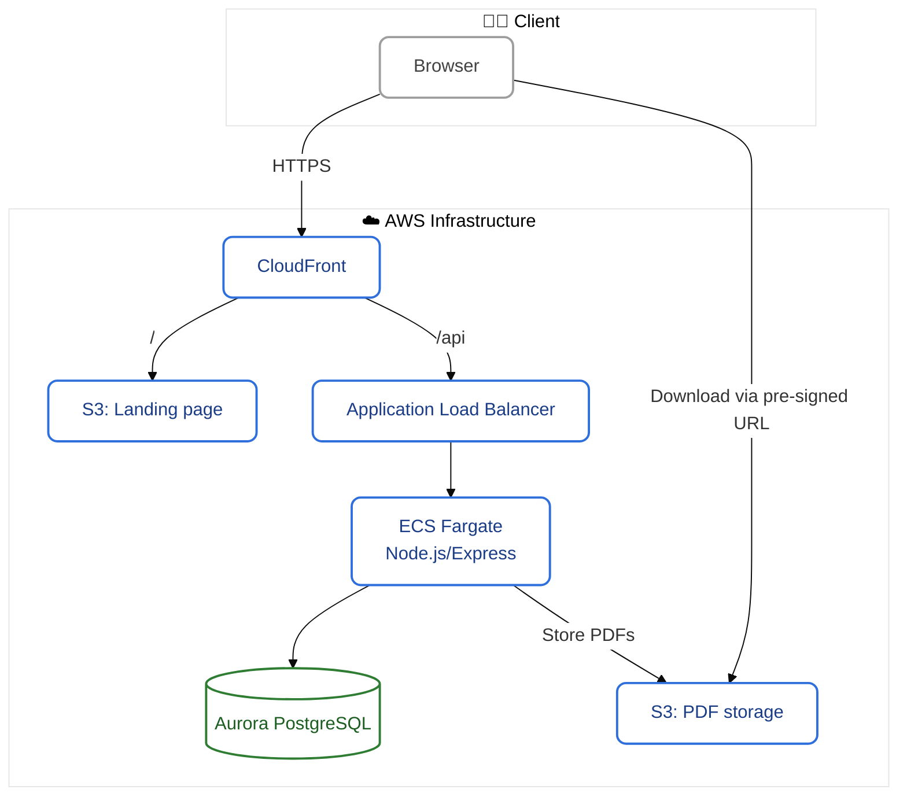

# 🌾 Siikli

[](https://github.com/juhawilppu/siikli/actions/workflows/ci.yml)
[](https://codecov.io/gh/juhawilppu/siikli)

Siikli is a modern ERP built for the realities of Finnish agriculture. In daily production use since 2017, it has processed more than €10M in invoices — simply, reliably, and without unnecessary complexity.

Rebuilt in 2025 with a modern architecture, Siikli streamlines the core operations of agricultural businesses — from inventory tracking to invoicing and customer management.


## 🚀 Features

- 📦 Orders & invoicing — from quote to paid invoice
- 👥 Customer & supplier management
- 📋 Product & price list management
- 📊 Exportable reports for bookkeeping
- 🔍 Full change history and audit trail

## 🛠️ Getting started

```
# 1. Configure environment variables
cp .env.example .env

# 2. Install dependencies & start
cd siikli
npm install
npm run dev
```

The frontend and backend run concurrently via `npm run dev`.

## Tech stack

- **Frontend:** `React`, `Vite`, `TypeScript`
- **Backend:** `Node.js`, `Express`
- **ORM:** `Prisma`
- **Database:** `PostgreSQL (Aurora RDS)`
- **Infrastructure as Code:** `Terraform`
- **Cloud:** `AWS (ECS Fargate, S3, RDS)`

## Project structure

```bash
siikli/
├── frontend/      # React frontend
├── backend/       # Backend source code
├── packages/      # Code shared between frontend and backend (REST types, utils)
├── terraform/     # Terraform files for AWS infra and deployment
├── .env           # Environment variables
└── ...
```

## Architecture



### Layered structure

Follows a **Service–Controller–Model** pattern for clarity, testability, and separation of concerns:

- **Controller** -- Handles HTTP, request validation, and permissions.
- **Services** -- Business logic.
- **Model** -- Database access via Prisma.

### Type safety

- No complex TypeScript generics (Omit, Partial, etc.).
- Each endpoint has dedicated request/response DTOs for explicit, predictable types.

### ORM-first

- Prisma is the default for DB access.
- Raw SQL used for performance-critical special cases.
- Database: `snake_case`; TypeScript: `camelCase`.

### Tenant isolation

- Every tenant has isolated data (`company_id` in all relevant tables).
- Prisma middleware enforces tenant scoping in queries.
- RBAC is tenant-aware.
- Tenant ID in JWT payload.

### History tables

- Every table has a `_history` table updated via triggers on `INSERT`, `UPDATE`, `DELETE`.
- Enables debugging, partial restores, and full change tracking.

To ensure schema consistency, run:

```bash
npx tsx ./src/dev/verify-history-tables.ts
```

Validates that history tables are in sync with schema.

### Handling monetary values

Finnish currency uses a comma and two decimals (`2,50`), but users may type `2.5` or `2,5`.

Solution: Keep monetary values as **strings** in the UI until calculations are needed.
- **Database:** `@db.Decimal(10, 2)` for exact precision.
- **API:** Uses strings (`"10.00"`) for serialization.
- **UI:** Accepts multiple formats (`"10"`, `"10,0"`, `"10.0"`, etc.), formats to `"10,00"` on blur.
- **Mobile:** Numeric keyboard for better UX.
- **Calculations:** Uses `decimal.js` for precision.

## Deployment

- ECS + Fargate for containers (running in `eu-north-1`, Sweden).
- RDS for database.
- Terraform for provisioning.

## Security

Security-first approach:

- ✅ Security headers & CSP
- ✅ SQL injection & XSS prevention via framework
- ✅ Role-based access control
- ✅ Tenant isolation via Prisma middleware
- ✅ UUID-based identifiers
- ✅ Rate-limiting
- ✅ Passwordless login (email-based OTP code)
- ✅ Secure cookies (HttpOnly)
- ✅ IDOR prevention

## Testing

- Unit tests for core business logic (e.g. waybill content, invoice sum calculations).
- End-to-end integration tests running against real services and database.
- ~700 lines of test code in total, ensuring correctness and long-term maintainability.

## Philosophy

- No unnecessary abstractions.
- Readable > clever.
- “Boring” tech that works.
- AI-assisted, human-led — AI used for prototyping, brainstorming, and autocomplete.
